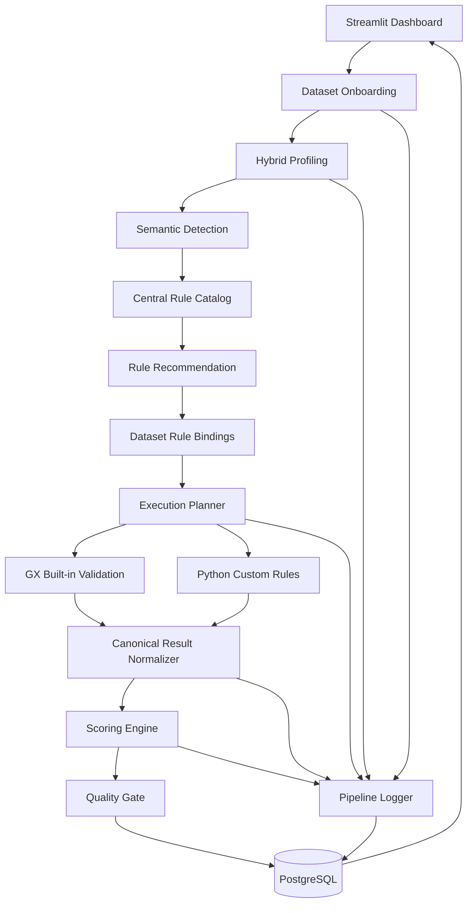

# DQ Scoring Refactor Plan — Rule & Score First, GX-Enabled

## 1. Mục tiêu

Refactor hệ thống DQ Scoring MVP theo bốn yêu cầu bắt buộc:

1. DQ Framework gồm 6 trụ cột: Completeness, Accuracy, Consistency, Timeliness, Uniqueness, Validity.
2. Pipeline profiling tự động quét CSV và trích xuất đặc trưng thống kê.
3. Rules Engine dùng bộ rule chung, tự động gợi ý rule khi thêm dataset.
4. Dashboard hiển thị DQ Score, điểm dimension, rule, issue sample và log.

Hai ưu tiên cao nhất:

```text
P0. Rule Framework phải tái sử dụng được, có semantics rõ và thực thi được.
P0. Scoring phải nhất quán, giải thích được và kiểm thử được.
```

GX được dùng làm execution and evidence engine; không thay Rule Catalog, Scoring Engine hoặc governance.

---

## 2. Phạm vi

### Trong phạm vi

- CSV, pandas, GX Core, PostgreSQL, Streamlit.
- Central Rule Catalog.
- General, Business, Technical Rules.
- Semantic detection cơ bản: email, phone, identifier, amount, age, datetime, category.
- Rule recommendation theo tên cột, kiểu dữ liệu và thống kê.
- Người dùng xác nhận Business Key, CDE, Mandatory và ID.
- GX built-in Expectations và Python fallback.
- Canonical Measurement Model.
- Rule Score, Dimension Score, Dataset DQ Score.
- Severity, field criticality, Quality Gate và score explanation.
- Pipeline log, issue sample giới hạn và score history.
- Bối cảnh kiểm định dataset trước khi công bố trên sàn dữ liệu.

### Ngoài phạm vi

- Spark, GX Cloud, multi-source Expectations.
- Custom GX framework hoàn chỉnh.
- ML anomaly detection, fuzzy matching, automated remediation.
- Scheduling production, job queue, RBAC enterprise.
- TrustScore, FinalScore.
- Data Marketplace hoàn chỉnh.
- Lưu toàn bộ violation rows.
- Data Docs public portal.

---

## 3. Nguyên tắc kiến trúc

### 3.1. PostgreSQL là nguồn sự thật

PostgreSQL quản lý dataset, version, column metadata, Rule Template, Rule Binding, Scoring Policy, canonical measurements, score history và logs.

GX Suite và Validation Definition chỉ là artifact thực thi sinh từ Rule Bindings.

### 3.2. GX là execution and evidence engine

GX chịu trách nhiệm:

- Data Source, Data Asset và Batch.
- Built-in Expectations.
- Expectation Suite.
- Validation Definition.
- Observed values, unexpected counts, indices và partial samples.

Ứng dụng chịu trách nhiệm:

- Profiling khám phá.
- Semantic detection.
- Rule Catalog và recommendation.
- Scoring và Quality Gate.
- Logs, dashboard và publication decision.

### 3.3. Không dùng GX success làm điểm

```text
GX success = kết quả đạt acceptance threshold.
Rule Score = kết quả tính từ canonical measurement.
```

---

## 4. DQ Framework

### Completeness

- Not null, not blank, mandatory completeness, missing ratio.

### Accuracy

Phân biệt:

```text
accuracy_mode = reference_based
accuracy_mode = plausibility_proxy
```

- Reference-based: đối chiếu master/reference data.
- Proxy: age range, amount non-negative, arithmetic consistency.

Dashboard phải ghi rõ “Accuracy Proxy” khi không có ground truth.

### Consistency

- Cross-field comparison, arithmetic relation, conditional required.

### Timeliness

- Date parseability, not-future khi phù hợp, freshness SLA.

### Uniqueness

- Primary/Business Key, composite key, full-row duplicate.

### Validity

- Type, regex, length, domain, date format, technical range.

---

## 5. Kiến trúc mục tiêu



---

## 6. Rule Framework — ưu tiên số 1

### 6.1. Ba loại scope

```text
management_scope: framework | dataset
target_scope: column | multiple_columns | dataset
evaluation_scope: record | column_aggregate | dataset_aggregate | cross_field
```

General Rule được quản lý ở framework nhưng có thể thực thi đến từng record.

### 6.2. Rule categories

#### General Rule

- Logic dùng chung.
- Tự động binding khi applicability thỏa mãn.
- Người dùng dataset không sửa logic gốc.
- Có thể chạy record-level, aggregate-level hoặc dataset-level.

#### Business Rule

- Logic nghiệp vụ riêng.
- Có thể được gợi ý hoặc tạo thủ công.
- Người dùng chỉnh threshold, severity và parameters.

#### Technical Rule

- Freshness, row count, schema stability, duplicate ratio.
- Có thể chỉ tham gia Quality Gate.

### 6.3. Rule Template

```yaml
rule_code: PHONE_TEN_DIGITS
rule_category: general
dimension: Validity
management_scope: framework
target_scope: column
evaluation_scope: record
operator: regex
applicability:
  semantic_type: phone
  inferred_type: string
parameters:
  pattern: '^\\d{10}$'
normalization:
  trim: true
  case: preserve
null_policy: separate
accuracy_mode: null
default_acceptance: 0.98
default_scoring_threshold: 98
default_severity: high
score_enabled: true
gate_enabled: false
scoring_method: pass_ratio
locked: true
active: true
```

### 6.4. Dataset Rule Binding

```yaml
binding_id: BR-0001
dataset_version_id: DV-0001
rule_template_id: RT-PHONE-001
target_column: phone_number
acceptance_threshold: 0.98
scoring_pass_threshold: 98
severity: high
backend: gx
status: active
source: framework_auto
recommendation_confidence: 0.94
score_enabled: true
gate_enabled: false
scoring_method: pass_ratio
```

### 6.5. Applicability và ngoại lệ

General Rule chỉ được binding khi applicability đủ điều kiện.

Trong phiên bản này chỉ hỗ trợ:

```text
applicability_status = applicable | not_applicable
exception_reason
```

Người dùng không sửa logic General Rule nhưng có thể khai báo không áp dụng, kèm lý do.

---

## 7. Profiling và Rule Recommendation

### 7.1. pandas profiling

Dataset metrics:

- Row count, column count, duplicate count/ratio, file size, duration.

Column metrics:

- Physical/inferred type.
- Null/blank ratio.
- Distinct count/ratio.
- Min, max, mean.
- String length.
- Top values.
- Numeric/datetime parse ratio.
- Pattern sample.

### 7.2. GX contribution vào profiling

GX phải tạo output nhìn thấy được trong profile:

- Element count.
- Missing count/percent.
- Unexpected count/percent.
- Observed min/max.
- Uniqueness evidence.
- Type conformance.

Mỗi metric lưu:

```text
metric_name
metric_value
metric_source = pandas | gx
gx_expectation_type
collected_at
```

### 7.3. Semantic Detection

Dựa trên tên cột, inferred type, pattern, distinct ratio, length và sample values.

Kết quả:

```text
semantic_type
confidence
evidence
```

Hệ thống chỉ gợi ý key/identifier/mandatory candidate. Người dùng xác nhận Business Key, CDE, Mandatory, ID và Timestamp.

### 7.4. Rule Recommendation

Output:

```text
rule_template_id
target_column(s)
reason
confidence
editable
```

General Rule auto-binding; Business/Technical Rules cần review.

---

## 8. Tích hợp GX — tận dụng thế mạnh nhưng không vượt phạm vi

### 8.1. GX artifacts

```text
Data Source: dq_pandas_source
Data Asset: asset__<dataset_id>
Batch Definition: whole_dataframe
Expectation Suite: suite__<dataset_id>__<ruleset_hash>
Validation Definition: validation__<dataset_id>__<ruleset_hash>
```

PostgreSQL quản lý dataset version; GX Batch không đại diện cho dataset version.

### 8.2. Rule mapping

GX built-in:

- Not null, regex, domain, range, length, type, single-column uniqueness, date format.

Python fallback:

- Cross-field arithmetic.
- Conditional required.
- Composite key.
- Full-row duplicate.
- Freshness custom.
- Schema drift.

### 8.3. Backend support matrix

| Operator | GX | Python | Result family |
|---|---:|---:|---|
| not_null | Yes | Yes | Map |
| regex | Yes | Yes | Map |
| domain | Yes | Yes | Map |
| range | Yes | Yes | Map |
| length | Yes | Yes | Map |
| type_check | Yes | Yes | Special |
| unique | Yes | Yes | Special |
| cross_field_compare | No | Yes | Map |
| conditional_required | No | Yes | Map |
| freshness | No | Yes | Aggregate |
| schema_drift | No | Yes | Aggregate |

### 8.4. Ruleset hash

```text
ruleset_hash = hash(
  rule_template_id,
  rule_template_version,
  target_columns,
  parameters,
  normalization_policy,
  null_policy,
  acceptance_threshold,
  backend,
  compiler_version
)
```

Hash tồn tại thì reuse Suite/Validation Definition; hash mới thì compile artifact mới.

### 8.5. Result format

```python
{
  "result_format": "SUMMARY",
  "partial_unexpected_count": 20,
  "unexpected_index_column_names": record_key_columns,
  "return_unexpected_index_query": False,
  "include_unexpected_rows": False
}
```

Không tự động rerun bằng COMPLETE.

### 8.6. Result adapters

Chỉ triển khai:

```text
MapExpectationAdapter
AggregateExpectationAdapter
SpecialExpectationAdapter
```

---

## 9. Canonical Measurement Model

### 9.1. Measurement Result

```text
measurement_result
- measurement_result_id
- validation_run_id
- binding_id
- evaluation_unit
- expectation_success
- measurement_status
- observed_value_jsonb
- expected_spec_jsonb
- failure_breakdown_jsonb
- backend
- execution_time_ms
- evaluated_at
```

### 9.2. Record Measurement Summary

```text
record_measurement_summary
- measurement_result_id
- passed_count
- failed_count
- missing_count
- not_applicable_count
- records_in_scope
```

### 9.3. Null policy

`fail`:

```text
records_in_scope = passed + failed + missing
```

`ignore`:

```text
records_in_scope = passed + failed
not_applicable += missing
```

`separate`:

```text
records_in_scope = passed + failed
missing được chấm bởi Completeness Rule riêng
```

Khuyến nghị:

```text
Validity → separate
Completeness → fail
```

---

## 10. Scoring Model — ưu tiên số 1

### 10.1. Scoring methods

Chỉ hỗ trợ:

```text
pass_ratio
freshness_decay
gate_only
```

#### pass_ratio

```text
BaseRuleScore = passed_count / records_in_scope × 100
```

Nếu `records_in_scope = 0`: `score = null`, `status = not_measured`.

#### freshness_decay

```text
100                  nếu lag <= SLA
giảm tuyến tính       nếu SLA < lag <= 2×SLA
0                    nếu lag > 2×SLA
```

#### gate_only

Không tham gia weighted score.

### 10.2. Field criticality

```text
Business Key            → Critical
CDE + Mandatory         → Critical
CDE                     → High
Mandatory               → High
Identifier + Mandatory  → High
Identifier              → Medium
Field thường            → Normal
```

Nếu có nhiều vai trò, lấy mức cao nhất.

| Criticality | Weight |
|---|---:|
| Critical | 1.50 |
| High | 1.25 |
| Medium | 1.10 |
| Normal | 1.00 |

### 10.3. Severity

| Severity | Weight |
|---|---:|
| Critical | 1.50 |
| High | 1.25 |
| Medium | 1.00 |
| Low | 0.75 |

### 10.4. Effective Rule Weight

```text
EffectiveRuleWeight = BaseRuleWeight × SeverityWeight × CriticalityWeight
```

Không dùng Rule Category Weight.

### 10.5. Dimension Score

```text
DimensionScore = Σ(BaseRuleScore × EffectiveRuleWeight) / Σ(EffectiveRuleWeight)
```

Chỉ tính rule `score_enabled = true` và `measurement_status = measured`.

### 10.6. Dataset DQ Score

```text
DatasetDQScore = Σ(DimensionScore × NormalizedDimensionWeight)
```

Dimension không đo được bị loại khỏi mẫu số.

### 10.7. Quality Gate

Chỉ xét rule `gate_enabled = true`.

Hard Gate tối thiểu:

```text
Business Key uniqueness dưới ngưỡng → fail
Critical Mandatory completeness dưới ngưỡng → fail
Không có measured rule → not_scored
```

Score status:

```text
>= 80 → pass
65–79.99 → warning
< 65 → fail
```

### 10.8. Score Explanation

```json
{
  "base_score": 92.4,
  "base_rule_weight": 1.0,
  "severity_weight": 1.25,
  "criticality_weight": 1.5,
  "effective_weight": 1.875,
  "field_roles": ["business_key", "mandatory"],
  "scoring_method": "pass_ratio",
  "rule_contribution": 17.8
}
```

---

## 11. PostgreSQL tối thiểu

### Dataset

- `dataset`
- `dataset_version`
- `dataset_column`

### Rule

- `rule_template`
- `dataset_rule_binding`

Bắt buộc có:

```text
management_scope
target_scope
evaluation_scope
accuracy_mode
null_policy
score_enabled
gate_enabled
scoring_method
```

### Profiling

- `profiling_run`
- `dataset_profile`
- `column_profile`

`column_profile` lưu `metric_source` và `gx_expectation_type`.

### Validation

- `validation_run`
- `measurement_result`
- `record_measurement_summary`
- `rule_issue_sample`

### Scoring

- `scoring_policy`
- `score_run`
- `rule_score_history`
- `dimension_score_history`
- `dataset_score_history`

### Logs

- `pipeline_log`

---

## 12. Dashboard

### Onboarding

1. Upload CSV.
2. Preview.
3. Profiling.
4. Semantic suggestions.
5. Confirm Business Key/CDE/Mandatory/ID.
6. Rule recommendation.
7. Configure editable rules.
8. Configure scoring.
9. Run validation.

### Rule Review

Hiển thị:

```text
Rule, Category, Dimension, Target, Evaluation scope,
Reason, Confidence, Acceptance threshold, Scoring threshold,
Severity, Criticality, Backend, Score enabled, Gate enabled, Locked
```

### Results

- Dataset DQ Score.
- Dimension Scores.
- Quality Gate.
- Rule Score và contribution.
- Effective weight.
- Issue sample.
- Run history.

### Logs

```text
dataset_loaded
profiling_started
profiling_completed
semantic_detection_completed
rules_recommended
rules_saved
gx_artifacts_resolved
gx_validation_completed
python_validation_completed
results_normalized
score_calculated
quality_gate_evaluated
results_persisted
```

---

## 13. Lộ trình triển khai

### Phase 0 — Baseline

- Golden results cho 4 datasets.
- Chốt Rule Template, Canonical Measurement và Scoring Policy contracts.

### Phase 1 — GX spike

Trên `customer_master`:

- Not-null, uniqueness, email regex, age range, status domain.
- Runtime DataFrame, Suite, Validation Definition, SUMMARY, unexpected indices.

Done khi có 5 parity tests và pin GX version.

### Phase 2 — Rule Framework

- PostgreSQL migrations.
- Rule Template, Rule Binding.
- General/Business/Technical seeds.
- Applicability và Recommendation.
- Rule Review UI tối thiểu.

### Phase 3 — GX Integration

- 7 GX operators.
- Ruleset hash.
- Artifact reuse.
- 3 result adapters.
- Python fallback.
- Issue sample masking.

### Phase 4 — Scoring V2

- pass_ratio, freshness_decay, gate_only.
- Null policy.
- Criticality, severity, dimension score, dataset score, gate, explanation.
- Calibration report.

### Phase 5 — Dashboard và Logs

```text
Upload → Profile → Recommend → Configure → Validate → Score → Gate → Visualize
```

Chạy end-to-end trên 4 dataset mẫu.

---

## 14. Kiểm thử

### Unit

- Inference, semantic detection, applicability, GX compiler, adapters, null policy, criticality, scoring, gate.

### Parity

```text
DataFrame → pandas expected → GX raw → canonical measurement
```

So sánh passed, failed, missing, not applicable và record keys.

### Boundary

- Empty dataset.
- Missing column.
- All null.
- Mixed types.
- Threshold boundary.
- Leading zeros.
- Whitespace.
- Case sensitivity.
- Duplicate keys.

### Calibration

Tiêm 1%, 5%, 10% lỗi và kiểm tra:

- Lỗi nhiều hơn giảm điểm nhiều hơn.
- Critical field ảnh hưởng hơn normal field.
- Weight ±10% không đảo hạng bất hợp lý.

---

## 15. Tiêu chí nghiệm thu

### Rule

- Có Central Rule Catalog.
- Có 3 categories.
- Scope rõ.
- General Rule quản lý ở framework và chạy được đến record-level.
- Rule recommendation có confidence.
- Rule Template độc lập GX.

### GX

- Thực thi thật built-in Expectations.
- Có Data Source, Asset, Batch, Suite, Validation Definition.
- Có SUMMARY result và unexpected indices.
- Có artifact reuse và parity tests.

### Scoring

- Null semantics rõ.
- Có 3 scoring methods.
- Có criticality và severity.
- Có Rule, Dimension và Dataset Score.
- Có Quality Gate và explanation.
- Có calibration report.

### Storage và UI

- PostgreSQL lưu metadata, rules, measurements, scores và logs.
- Dashboard có onboarding, rule review, scoring configuration, results và logs.

---

## 16. Kết luận

Phạm vi refactor chốt ở:

```text
DQ Framework 6 dimensions
+ Hybrid Profiling
+ Central Rule Catalog
+ Rule Recommendation
+ GX Built-in Validation
+ Python Fallback
+ Canonical Measurements
+ Explainable Scoring
+ Quality Gate
+ PostgreSQL
+ Dashboard and Logs
```

Thứ tự ưu tiên:

```text
1. Rule semantics
2. Canonical measurements
3. Scoring semantics
4. GX execution
5. Storage
6. Dashboard
```

Không mở rộng GX Cloud, Spark, scheduling, custom GX framework hoặc marketplace đầy đủ trước khi Rule Framework và Scoring được nghiệm thu.
